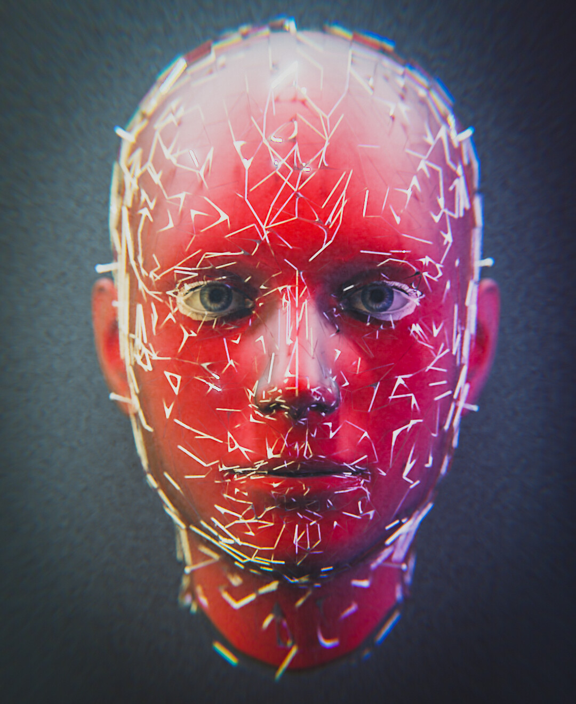
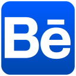
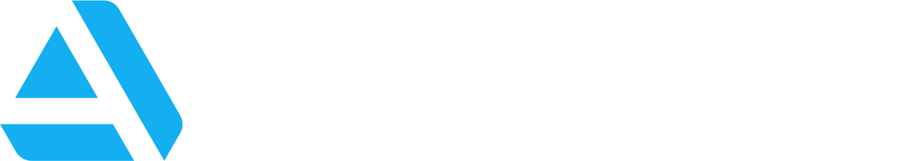

<h1 align="center">👨🏻‍💻 Engineer by day, Designer by night👨🏻‍🎨</h1>

        ℓєєℓα ѕαι ρяαѕαηтн

    - 🌱 learning * Webstack *

    - 🔭 Createing **Abstract Designs**

<h3 align="left">Connect with me:</h3>

    
    
    
     
    

<h3 align="left">Languages:</h3>

    
    
    

<h3 align="left">Web Stack:</h3>

    
    
    
    
    
    

<h3 align="left">Design Tools:</h3>

    
    
    

## Refernce materials:

Sample Readme : https://github.com/othneildrew/Best-README-Template
